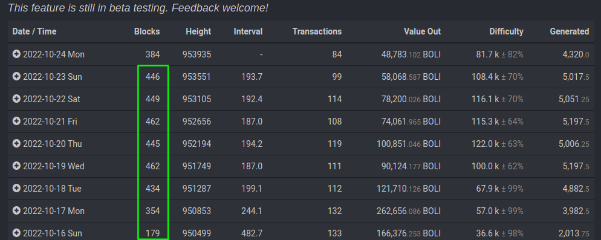
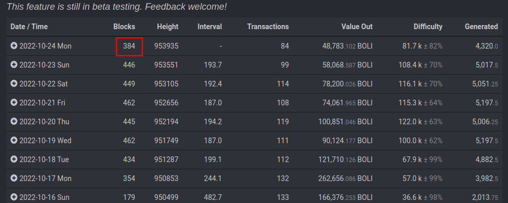
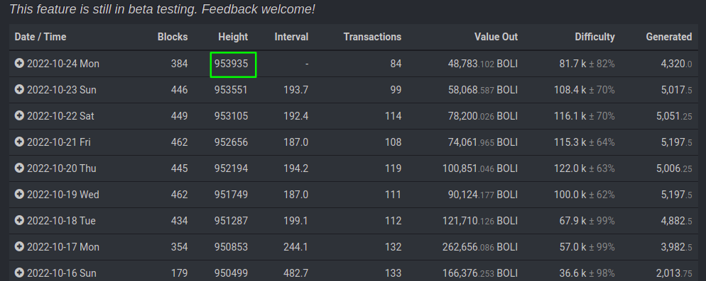
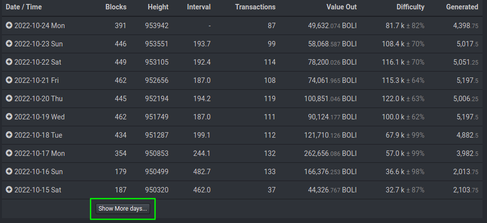
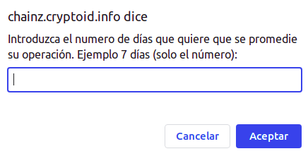
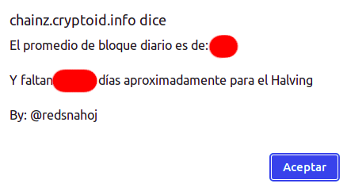

# boli-halving-cryptoid

Este pequeño script esta hecho para ser usado en [cryptoID](https://chainz.cryptoid.info/boli/#!overview). Lo que hace es calcular el promedio y, a partir de el obtener un aproximado de los días que faltan para el halving de Bolicoin.

## ¿Cómo realiza el calculo?

El script obtiene los datos de la siguiente columna:

Con los datos obtenidos calculara el promedio diario según la cantidad de que especifique el usuario. Por ejemplo si quiere obtener un promedio de 15 días, el script tomara los datos de 15 días, los sumara y luego lo dividirá entre 15.

El script siempre omitirá el primer valor (hoy), y comenzara a contar a partir de un día anterior (ayer). Ya que se supone que el día actual aun no termina para ser usado en el promedio:

Luego se obtiene el siguiente valor:

Este es el bloque actual, el cual es restado a 1000000 (bloque halving) y así se obtiene la cantidad de bloques que faltan para el halving. Luego la cantidad de bloques que faltan para el halving es dividida entre el promedio obtenido y así se obtiene la cantidad de días aproximado que faltan para el halving. El promedio variara según la cantidad que el usuario especifique.

## ¿Cómo se usa el script?

Para utilizar el script abra el archivo "script.js" y copie todo su contenido. Luego abra su navegador e introduzca la siguiente URL para ver el explorador cryptoID "[https://chainz.cryptoid.info/boli/#!overview](https://chainz.cryptoid.info/boli/#!overview)".

Una vez en ella vaya al final de la web y haga click en el siguiente botón hasta que muestre los datos que necesite. Por ejemplo, si quiere un promedio de 30 días, haga click en el botón hasta que le muestre los 30 días:

Luego presione <code>f12</code> o <code>Ctrl+Shift+I</code> para abrir las herramientas del desarrollador, vaya a "console", pegue el código copiado anteriormente y presione enter, le aparecerá la siguiente ventana donde deberá introducir el promedio a obtener, por ejemplo si quiere un promedio de 7 días introduzca y un 7:

Luego de introducir un valor obtendrá el resultado:

